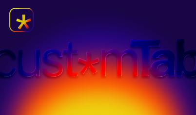

<div align="center"></div>

> Your tab. Your rules. — Zero-friction custom new tab for Chrome.

A Chrome MV3 extension that fixes every critical bug in "Custom New Tab URL" and competing extensions.

## What it fixes

| Pain | Fix |
|------|-----|
| URL bar steals focus on new tab | Focus stolen back immediately (synchronous, before any async code) |
| Local `file://` pages silently fail | Detects missing permission, shows step-by-step inline guide |
| Chrome periodically disables the extension | Alarm-based persistence monitor + notification if new tab hasn't fired in 2+ hours |
| No onboarding — options page is impossible to find | Auto-opens settings on first install with welcome walkthrough |
| Target URL visible in address bar | Iframe mode keeps extension URL in address bar (configurable) |
| `chrome-extension://` URLs blocked | Handled natively via iframe |

## Install (development)

1. **Generate icons** (one-time):
   ```bash
   node extension/icons/generate-icons.js
   ```
   _Or open `extension/icons/create-icons.html` in Chrome and click "Generate & Download Icons"._

2. Open Chrome → `chrome://extensions`
3. Enable **Developer mode** (top-right toggle)
4. Click **Load unpacked** → select the `extension/` folder
5. Open a new tab — the extension opens settings on first run

## File structure

```
extension/
├── manifest.json          # MV3 manifest
├── background.js          # Service worker (alarms, onboarding, persistence)
├── newtab.html/css/js     # New tab override
├── options.html/css/js    # Settings page
└── icons/
    ├── icon.svg           # Source SVG
    ├── generate-icons.js  # Node.js PNG generator (zero deps)
    └── create-icons.html  # Browser-based PNG generator (no Node required)
```

## Settings

| Setting | Default | Description |
|---------|---------|-------------|
| Target URL | — | Any `https://`, `http://`, `file://`, or `chrome-extension://` URL |
| Hide URL in address bar | On | Uses iframe; some sites block embedding (X-Frame-Options) |
| Preload every 10 min | Off | Background refresh for JS-heavy dashboards (v1.1) |

## Stack

- **Manifest V3** — MV3-compliant, no persistent background scripts
- **No frameworks** — vanilla HTML/CSS/JS, total weight < 50 KB
- **Permissions**: `tabs`, `storage`, `alarms`, `notifications`
- **Optional**: `host_permissions` (`<all_urls>`) — requested only if needed

## License

MIT
